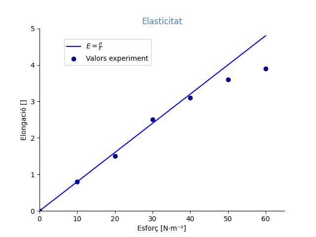

# Matplotlib





## 0 Importar la biblioteca

```python
import matplotlib.pyplot as plt
```

## 1 Crear figura i eixos

La figura es refereix a tot el conjunt, incloent-hi eixos, gràfic, títols, llegenda, fons, etc.

Eixos, per a *matplotlib*, és tot l'interior què es representa, eixos en si, graella, marques, etiquetes d'eixos, colors...

Gràfic, per a *matplotlib*, és la representació de les dades: les línies, punts, barres...

```python
figura, eixos = plt.subplots()
```

## 2 Crear el gràfic

Dades:

- Les dades han d'estar en llistes.
- Si volem representar gràfics amb dues variables relacionades aquestes han de tenir el mateix nombre de dades. En l'exemple es preparen tres variables: esforç, elongació i recta.
- Podem posar les dades en la mateixa funció de Python on es crea la figura, però és recomanable fer-ho en una altra funció.

En l'exemple

```python
esforc = [0, 10, 20, 30, 40, 50, 60]
elongacio = [0, .8, 1.5, 2.5, 3.1, 3.6, 3.9]
recta = [0, .8, 1.6, 2.4, 3.2, 4.0, 4.8 ]

eixos.plot(esforc, recta, color='blue', label="Esforç")
eixos.scatter(esforc, elongacio, color='darkblue', label="Valors experiment")
```

1. Gràfic de línia (*plot*, uneix els punts amb línies rectes) amb **esforc** com a variable independent, x, i **elongacio** com variable dependent, y.
2. Gràfic de punts (*scatter*) amb **esforc** com a variable independent, x, i **elongacio** com variable dependent, y.

- [Tipus de gràfics](<https://matplotlib.org/stable/plot_types/index.html>)
- [Colors definits](<https://matplotlib.org/stable/gallery/color/named_colors.html#css-colors>)

## 3 Definir aspecte

Títols i llegenda:

```python
plt.title("Elasticitat", color='SteelBlue')
eixos.set_xlabel("Esforç [N·m⁻²]")
eixos.set_ylabel("Elongació []$")
eixos.legend(loc=(0.1, 0.8))
```

Als títols es poden utilitzar expressions en Latex, però és complex de dominar. L'alternativa és fer servir caràcters unicode que inclouen [lletres greges](<https://symbl.cc/es/collections/greek-symbols/>), [caràcters matemàtics](<https://symbl.cc/en/collections/mathematical-signs/>) i [superíndex](<https://symbl.cc/en/collections/superscript-and-subscript-numbers/>).

Màxims i mínims dels eixos

```python
eixos.set_xlim(0, 65)
eixos.set_ylim(0, 5)
```

Marques d'eixos:

```python
eixos.set_xticks(range(0, 65, 10))
eixos.set_yticks(range(0, 5, 1))
```

Marques d'eixos en blanc

```python
eixos.set_xticks([])
eixos.set_yticks([])
```

Si no s'indiquen les marques dels eixos, s'utilitzen les dades x com etiquetes. S'ha d'anar amb compte, ja que en aquest cas no respecten l'escala numèrica.

Eixos a igual escala

```python
eixos.set_aspect('equal')
```

Moure i ocultar els eixos, per a matplotlib, *spines*:

```python
eixos.spines['right'].set_color('none')
eixos.spines['top'].set_color('none')
eixos.spines['bottom'].set_position(('data', 0))
eixos.spines['left'].set_position(('data', 0))
```

## 4 Renderitzar

Mostrar el gràfic:

```python
plt.show()
```

Guardar el gràfic en un fitxer, compte que en VSCode deixa el gràfic en llocs insospitats:

```python
plt.savefig("matplotlib4.png")
plt.close()
```

## Xuletes i manuals

A la pàgina web de Matplotlib també es poden trobar *cheatsheets* molt enfocats a aspectes pràctics: [Matplotlib Cheat Sheets](<https://matplotlib.org/cheatsheets/>).
